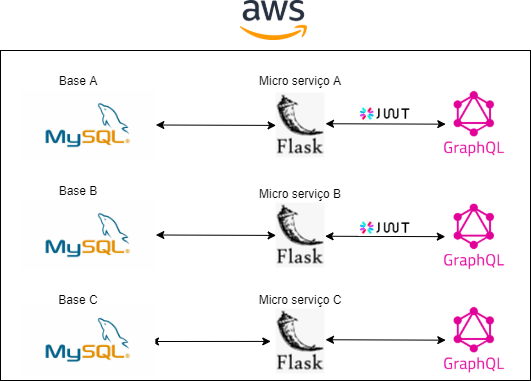
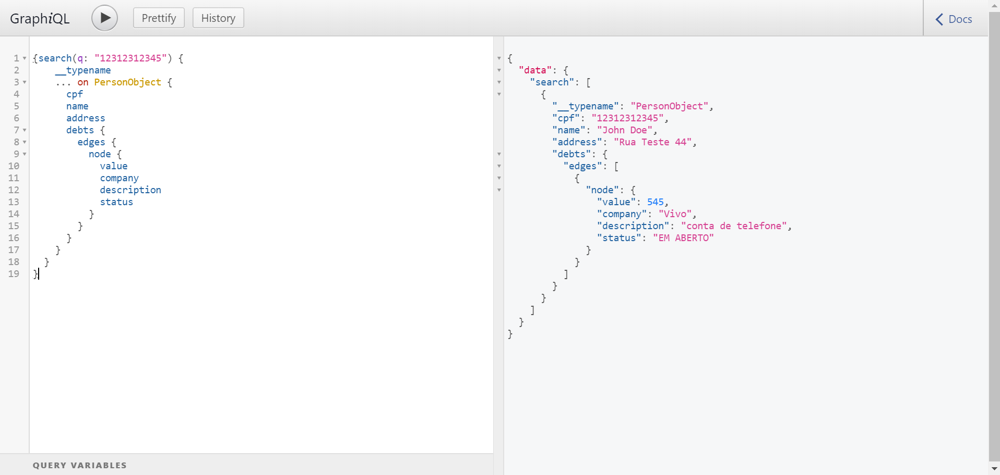
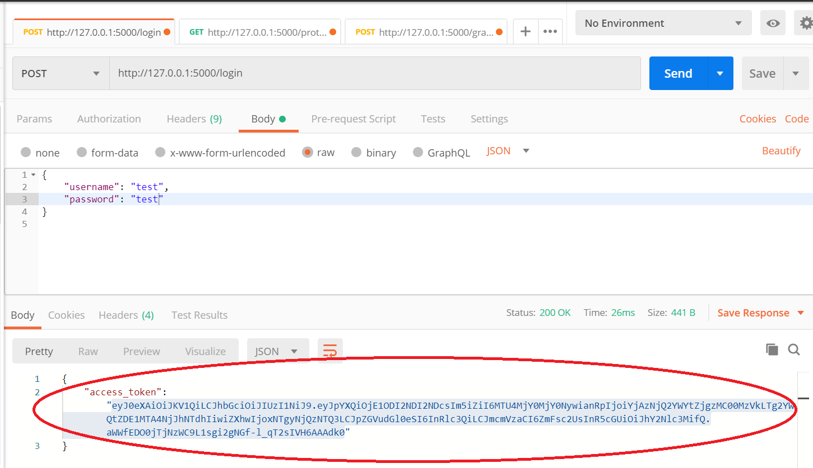
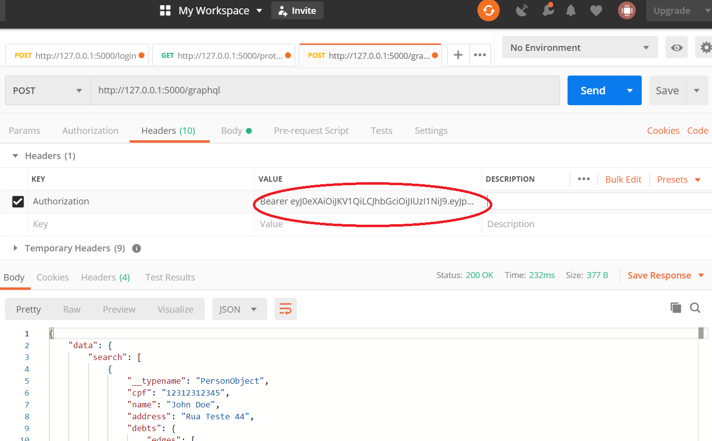

# Desafio

## Arquitetura proposta


### Armazenamento
* A Base A precisa de alta segurança, porém não necessita de uma boa performance. Optei por usar MySQL que é rápido e seguro, além de open source. Outra opção igualmente boa seria PostgreSQL.
* A basa B precisa de uma segurança mediana e uma performance alta. Para isso, MySQL também é uma opção boa.
* A base C não necessita de tanta segurança e precisa de uma performance altíssima. Tanto MySQL quanto MongoDB são opções viáveis, cada uma com seus pontos fortes. O gráfico(*) abaixo mostra como, num  experimento comparativo, MySQL foi bem mais rápido em select, enquanto MongoDB em update e insert. Levando-se isso em consideração, optei por usar MySQL aqui também.


Fonte: https://dzone.com/articles/comparing-mongodb-amp-mysql
(*Performance para 1.000.000 de registros.)

As bases de dados devem ter o acesso restrito. Todas terão senhas de acesso. 

Algumas outras medidas de segurança deverão ser implementadas no próprio servidor AWS (e por isso não foram implementadas nesse modelo):
* A base A terá dados encriptados.
* As bases A e B terão o acesso restrito aos micro serviços que a acessam, e se necessário conexão de usuários devem estar em rede controlada

### Tráfego
Os três micro serviços são em Flask. Entre os frameworks mais populares de Python (Django, Flask e Pyramid) ele é o que permite um projeto menor e com menos camadas e complexidade de código, o que aumenta um pouco a performance. Como será desenvolvido um micro serviço simples para conectar a base de dados com o usuário ele é ideal.

### Disponibilização dos Dados
Os dados serão disponibilizados via GraphQL. Diferente das APIs Restful o GraphQL dá ao usuário mais liberdade em relação a quais dados ele irá acessar no mesmo endpoint. Isso pode aumentar a velocidade de trânsito de dados para casos em que o usuário precisa de poucas informações.
Também diminui a necessidade de criação de novos endpoints cada vez que um usuário precisa acessar um tipo diferente de dado.


Cada projeto terá sua própria implementação da ferramenta, permitindo que cada usuário tenha acesso apenas ao micro serviço que lhe for necessário.

A conexão entre o GraphQL e o micro serviço é feita por JWT para os micro serviços A e B, onde o usuário precisa fornecer um login e senha para o micro serviço e receberá um token temporário de acesso.



## Como executar o projeto
Instalar docker

O docker-compose, além de criar um container com as dependências do projeto irá popular os bancos de dados com dados de exemplo.
### Micro serviço A
```
sudo docker-compose build mysql data-debts
sudo docker-compose up mysql data-debts
```
* Acessar: http://0.0.0.0:5000/login com username: 'admin' e password: 'desafio123' para o código de autenticação.
* Acessar: http://0.0.0.0:5000/graphql com a autenticação do passo anterior.

Exemplos de buscas: 
* Para acessar todas as dívidas na base de dados:
```
{
  allDebts{
    edges{
      node{
        value
        company
        description
        date
        status
        debtor{
          cpf
          name
          address
        }
      }
    }
  }
}
```
* Para acessar todas as pessoas com as respectivas dívidas:
```
{
  allPersons{
    edges{
      node{
        cpf
        name
        address
        debts{
          edges{
            node{
              value
              company
              date
              status
            }
          }
        }
      }
    }
  }
}
```
* Para buscar um CPF específico:
```
{search(q: "12312312345") {
    __typename
    ... on PersonObject {
      cpf
      name
      address
      debts {
        edges {
          node {
            value
            company
            description
            status
          }
        }
      }
    }
  }
}
```
### Micro serviço B

```
sudo docker-compose build mysql_b score
sudo docker-compose up mysql_b score
```
* Acessar: http://0.0.0.0:5000/login com username: 'admin' e password: 'desafio123' para o código de autenticação.
* Acessar: http://0.0.0.0:5000/graphql com a autenticação do passo anterior.

Exemplos de buscas: 
* Para acessar todos os bens na base de dados:
```
{
  allAssets{
    edges{
      node{
        value
        description
        owner{
          cpf
          name
          address
        }
      }
    }
  }
}
```
* Para acessar todas as pessoas com os respectivos bens:
```
{
  allPersons{
    edges{
      node{
        cpf
        name
        address
        assets{
          edges{
            node{
              value
              description
            }
          }
        }
      }
    }
  }
}
```
* Para buscar um CPF específico:
```
{search(q: "12312312345") {
    __typename
    ... on PersonObject {
      cpf
      name
      address
      assets {
        edges {
          node {
            value
            description
          }
        }
      }
    }
  }
}
```

### Micro serviço C
```
sudo docker-compose build mysql_c document-events
sudo docker-compose up mysql_c document-events
```

* Acessar: http://0.0.0.0:5000/graphql

* Para buscar todos os eventos:
```
{
  allEvents{
    edges{
      node{
        cpf
        lastQuery
        financialTransactions
        lastBuy
      }
    }
  }
}
```
* Para buscar um CPF específico:
```
query{
  findEvent(cpf: "12312312345") {
    lastQuery
    financialTransactions
    lastBuy
  }
}
```